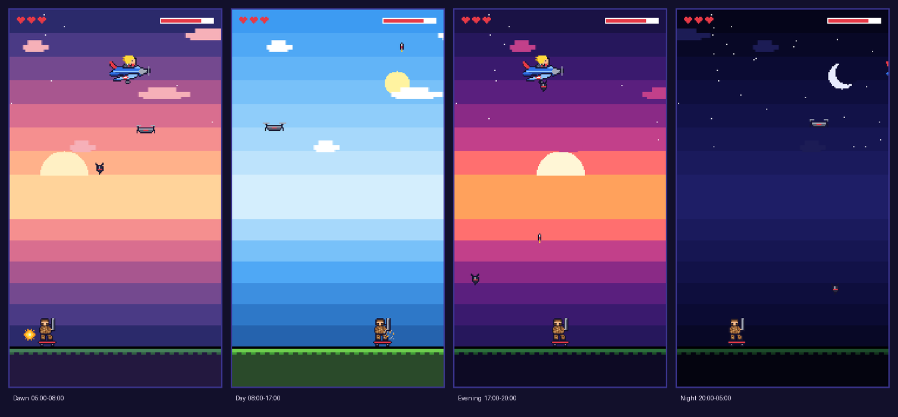
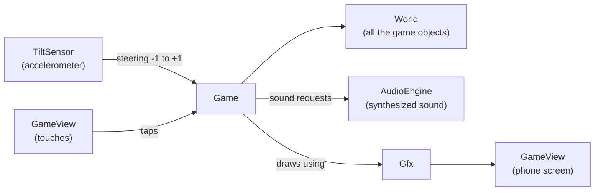
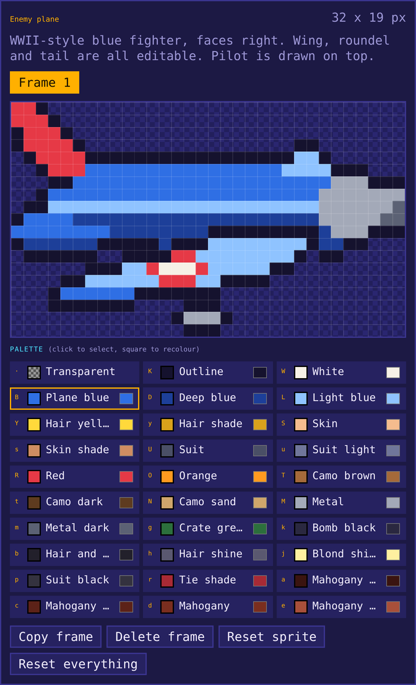

# Retro Shooter

**An 80s pixel-art game for your phone. Tilt to move, tap to shoot, and bring down the plane.**

|  |  |
|---|---|
| **Designed and directed by** | **Aziz** |
| **Developed by** | **Claude** (Anthropic) |

This is a teaching project. The whole game is plain Kotlin with no game engine and no libraries, so students can read every line, change it, and see the result on a real phone.

---

## Contents

1. [The game](#the-game)
2. [How to play](#how-to-play)
3. [Run it on your phone](#run-it-on-your-phone)
4. [How it works](#how-it-works)
5. [What to change](#what-to-change)
6. [Tests](#tests)
7. [Share your change: pushing to main](#share-your-change-pushing-to-main)
8. [Project layout](#project-layout)
9. [Tools](#tools)
10. [Credits](#credits)

---

## The game

A blue prop plane flies across the top of the screen, and its laughing pilot drops bombs on you. You are a soldier in brown camo on a skateboard, with a rocket launcher. You have a limited number of rockets, three lives, and ten levels to get through. Every level, the plane is faster and drops more bombs.

### The sky follows your clock

The background changes with the time of day on your phone. Open the game in the morning, at lunch, at sunset and late at night, and you get four different skies.



| Look | Hours (24 hour clock) |
|---|---|
| Dawn | 05:00 to 07:59 |
| Day | 08:00 to 16:59 |
| Evening | 17:00 to 19:59 |
| Night | 20:00 to 04:59 |

Want to see them all without waiting? Either change your phone's clock (turn off "Set time automatically" in the phone's date and time settings), or change the hours in `GameConfig.kt`. See [What to change](#what-to-change).

---

## How to play

### Controls

| Do this | To do that |
|---|---|
| **Tilt the phone left or right** | Drive the skateboard. Tilt more to go faster. |
| **Tap the screen** | Fire a rocket (it flies straight up). |
| **Tap the music note** (top right corner) | Turn the music on or off. It remembers your choice. |

Hold the phone upright (portrait). The game stays in portrait on purpose, so tilting steers instead of turning the screen.

### The screen

- **Hearts** (top left): your lives. You start with 3 and can hold up to 5.
- **Rocket icon with a number** (below the hearts): rockets left. The number turns red when you run out.
- **ENEMY bar** (top right): the plane's health. Every hit takes some off.
- **LEVEL** (top middle): the level you are on.
- **Thin light blue bar** (under the rockets): how long your shield has left, when you have one.

### The goal

Hit the plane with rockets until its health bar is empty. Then the next level starts. Beat all **10 levels** to win the game. Lose all your lives and it is game over.

### Supply drone

Every so often a small grey drone flies across the screen and drops a crate on a parachute. Catch it by driving under it.

| Crate | What it gives you |
|---|---|
| Heart (white) | +1 life |
| Rocket (green) | +5 rockets |
| Shield (blue) | A bubble that blocks the next bomb, for up to 8 seconds |

Crates that land are left on the ground for a few seconds, then blink and vanish. The drone is friendly, so your rockets pass straight through it.

### Tips

- **Do not stand still.** Some bombs are aimed. The plane waits until it is right over you.
- **Rockets are limited.** Use them when you have a good shot. You get 5 more at the start of every level, and the green crates help too.
- **Lead your shots.** A rocket takes a moment to reach the plane, so aim where it is going, not where it is.
- **Watch the crates.** They swing from side to side more and more as the levels go up.
- **A bomb that hits you gives you a moment of protection.** You blink while it lasts.
- **Listen.** Each sound means something: the whistle of a falling bomb, the click of an empty launcher, a happy jingle for a crate.

### Surprises

There is a surprise waiting if you beat level 10, and another one if you lose. No spoilers here.

---

## Run it on your phone

### What you need

- **Android Studio**, Otter 2 or newer.
- An **Android phone** with Android 8.0 or newer, and a USB cable.
- On the phone: turn on **Developer options** (tap *Build number* seven times in Settings, About phone), then turn on **USB debugging**.

### Steps

1. Clone the project: **File, New, Project from Version Control**, paste the repository address, click **Clone**.
2. If Android Studio asks which **Gradle JVM** to use, choose **JVM 21**. (You can also set it in Settings, Build, Execution, Deployment, Build Tools, Gradle, Gradle JDK.)
3. Wait for the Gradle sync to finish. The first time it downloads a few things, so give it a few minutes.
4. Plug in your phone and allow USB debugging when the phone asks. Your phone appears in the device list at the top of Android Studio.
5. Press the green **Run** button.

### Is the soldier going the wrong way?

Open `app/src/main/java/com/example/retroshooter/config/GameConfig.kt` and change `TILT_INVERT` to `true`.

### No phone? Use the emulator

It works, but tilting is awkward. In the emulator's side bar, open **...** (Extended controls), then **Virtual sensors**, and use the device rotation sliders to tilt.

---

## How it works

### The big picture



`MainActivity` creates these pieces and connects them. `GameView` runs the game loop and shows the picture. `Game` decides which screen you are on and applies the rules. `World` holds everything that exists right now.

### The game loop

`engine/GameThread.kt` repeats this about 60 times a second:

1. Pass any taps to the game.
2. Update the game in fixed steps of 1/60 of a second. A fixed step makes the game run at the same speed on every phone.
3. Draw one picture.
4. Sleep a little, so the battery is not burned.

### Chunky pixels

The game is drawn on a tiny picture that is only **180 pixels wide**. That picture is then stretched to fill the phone with no smoothing, which is what makes the pixels big and sharp. The height changes with the phone (320 to 400 game pixels), so tall phones get a taller sky.

### Everything is an Entity

The soldier, the plane, bombs, rockets, the drone, crates and explosions all extend one small base class, `game/Entity.kt`. Each has a position and a hitbox, and two jobs: `update()` (move and think) and `draw()` (paint itself). `World` keeps a list of each kind, moves them all, and checks who hit whom.

To add a new kind of thing to the game, write a new class that extends `Entity` and add it to `World`.

### Sprites are text

Every picture is a list of text rows. Each letter is a color from a palette, and `.` is empty. This is a tiny 3 by 2 sprite:

```kotlin
Sprite(
    "RRR",
    "R.R"
)
```

All the sprites live in `graphics/Sprites.kt`. You do not have to type them by hand: the **Sprite Lab** (see [Tools](#tools)) lets you paint them and gives you the code to paste.

### Sound is made from numbers

There are no sound files. `audio/SoundSynth.kt` is a tiny synthesizer, like the sound chips in 80s arcade machines. A sound is a long list of numbers between -1 and 1, and the speaker reads them 22,050 times a second. Three wave shapes make everything: a buzzy **square**, a soft **triangle**, and random **noise**. `SoundEffects.kt` has the recipe for every effect, and `Music.kt` builds the looping tune note by note, faster on higher levels.

### Steering by tilting

`input/TiltFilter.kt` turns raw accelerometer readings into a number from -1 (full left) to +1 (full right). It smooths out shaky hands, ignores tiny tilts (the dead zone), and scales the rest. All three are settings in `GameConfig.kt`.

### The game does not need a phone to be tested

The game rules, the sound synthesizer and the sprite data never call Android. They only draw through a tiny interface, `Gfx`, and play sound through another, `SoundPlayer`. On the phone those are the real thing. In the tests they are fakes, so the whole game can be played by a computer. That is why the tests can play entire levels in a fraction of a second.

---

## What to change

Change something, press Run, and play. Every number has a comment saying what it does.

| I want to... | Go to | What to do |
|---|---|---|
| Make the game easier or harder | `config/GameConfig.kt` | Change `LIVES_START`, `AMMO_START`, `PLANE_SPEED_GROWTH`, `BOMB_INTERVAL_FACTOR`, `BOMB_AIM_CHANCE_BASE`... |
| Change how many levels there are | `config/GameConfig.kt` | `LEVEL_COUNT` |
| Change how often the drone comes | `config/GameConfig.kt` | `DRONE_FIRST_DELAY` and `DRONE_INTERVAL` |
| Change which crates are common | `config/GameConfig.kt` | `CRATE_WEIGHT_LIFE`, `CRATE_WEIGHT_AMMO`, `CRATE_WEIGHT_SHIELD` |
| Rename the game on the title screen | `config/GameConfig.kt` | `GAME_TITLE` |
| Fix or tune the tilt | `config/GameConfig.kt` | `TILT_INVERT`, `TILT_DEAD_ZONE`, `TILT_FULL_SPEED`, `TILT_SMOOTHING` |
| See every sky | `config/GameConfig.kt` | `DAWN_START_HOUR`, `DAY_START_HOUR`, `EVENING_START_HOUR`, `NIGHT_START_HOUR` |
| Turn the music off by default | `config/GameConfig.kt` | `MUSIC_DEFAULT_ON = false` |
| Change how each level scales up | `config/Levels.kt` | Edit `LevelSettings.forLevel`. Give one level special numbers for a boss level. |
| Redraw a character | the Sprite Lab, then `graphics/Sprites.kt` | See below |
| Change how something sounds | `audio/SoundEffects.kt` | Change the pitch, length or volume numbers |
| Change the music | `audio/Music.kt` | Change the notes in `melody` (MIDI note numbers, 69 is A440) |
| Change the colors of the sky | `graphics/Background.kt` | Edit the color lists for a time of day |
| Add a new power-up crate | `game/CrateType.kt` | Add one entry with a picture, a weight and what it does |
| Change the app icon | `tools/make_icon.py` | Edit the pixel grid, run the script (see [Tools](#tools)) |

### Redrawing a sprite

1. Open `tools/sprite-lab.html` in a web browser (double-click it).
2. Pick a sprite, then paint with the palette. The scene on the left updates live.
3. Click **Copy this sprite**.
4. In Android Studio, open `graphics/Sprites.kt`, find the sprite with the same name, and paste over it.
5. Press Run.

To replace all sprites at once, click **Copy Sprites.kt (all)** and replace the whole file.



> **Careful:** next to "Game scene", the Sprite Lab's live preview has two more tabs. They show the game's surprises. Look at them last!

### Ideas to try

- Make the plane twice as fast on level 1.
- Give the soldier 10 lives.
- Make every bomb aimed (set `BOMB_AIM_CHANCE_BASE` and `BOMB_AIM_CHANCE_MAX` to `1.0f`).
- Make crates sway wildly from level 1 (`CRATE_SWAY_BASE`).
- Recolor the soldier's camo in the Sprite Lab.
- Change the rocket launch sound to something silly.
- Add a fourth crate type that gives you 5 lives at once.
- Add a brand new enemy: a second, slower plane that drops two bombs at a time.

---

## Tests

The project has unit tests that play the game on a computer.

- In Android Studio: right-click the `app/src/test` folder and choose **Run Tests**.
- Or in a terminal: `./gradlew testDebugUnitTest`

They check, among other things, that every level is at least as hard as the one before, that crates do what they promise, that a bot can beat the first level, that standing still and never shooting loses, that every sprite only uses colors from the palette, and that every screen draws correctly on short and tall phones at every time of day.

**Run the tests before you push.** If you edit a sprite and make a typo, the sprite test tells you exactly which one.

---

## Share your change: pushing to main

Work on the `main` branch. Whenever you have a change you are happy with:

### In Android Studio

1. **Get the latest first.** Click the branch name at the top, choose `main`, then **Update**. Choose **Merge** if it asks. This stops your push from being rejected.
2. Make your change and press Run to try it on your phone.
3. Run the tests.
4. Open the **Commit** panel (**Git, Commit...** or Ctrl+K / Cmd+K).
5. Tick the files you changed, write a short message that says what you did (for example `Make the plane faster on level 1`), and click **Commit and Push...**.
6. In the Push window, check that it says `main` going to `origin/main`, then click **Push**.

### In a terminal

```bash
git checkout main
git pull                                  # get the latest first
# ...make your change, run the game and the tests...
git add -A
git commit -m "Make the plane faster on level 1"
git push origin main
```

**If the push is rejected:** someone else pushed first. Run `git pull`, run the tests again, then push again.

**Good habits:** small changes, one idea per commit, a message that explains what changed, and do not commit `local.properties` (it is already ignored).

---

## Project layout

```
app/src/main/java/com/example/retroshooter/
  MainActivity.kt        connects the pieces, full screen, start and stop
  config/
    GameConfig.kt        every setting you can tune
    Levels.kt            how each level gets harder
  game/
    Game.kt              which screen you are on, and the rules
    World.kt             every object in the game, and collisions
    Entity.kt            the base class for everything that moves
    Player.kt  EnemyPlane.kt  Bomb.kt  Rocket.kt  Drone.kt  Crate.kt  CrateType.kt  Explosion.kt
    Hud.kt               hearts, rockets, health bar, music button
    VictoryScreen.kt  GameOverScreen.kt   the two end screens (surprise!)
  graphics/
    Sprites.kt           all the pictures, as text
    Sprite.kt  Gfx.kt  AndroidGfx.kt    drawing
    PixelFont.kt  TextBox.kt            the built-in pixel text
    Background.kt  TimeOfDay.kt         the skies
  audio/
    SoundSynth.kt  SoundEffects.kt  Music.kt  Sfx.kt   making the sound
    AudioEngine.kt  SoundPlayer.kt                     playing it
  input/
    TiltSensor.kt  TiltFilter.kt        steering
  engine/
    GameThread.kt  GameView.kt          the loop and the screen
app/src/test/            tests that play the game on a computer
tools/                   the Sprite Lab and the icon maker
docs/                    screenshots and the developer's working plan
```

---

## Tools

### Sprite Lab (`tools/sprite-lab.html`)

A web page for painting the game's sprites. It runs in any browser with no setup. Pick a sprite, paint pixels, recolor the palette, and the live preview updates. It writes the Kotlin code for you. See [Redrawing a sprite](#redrawing-a-sprite).

### Icon maker (`tools/make_icon.py`)

The app icon is the project logo redrawn as pixel art. The pixels are a grid of letters inside the script. Edit the grid, then run this from the project root:

```bash
python3 tools/make_icon.py
```

It rewrites the icon files under `app/src/main/res/`.

### `docs/PLAN.md`

The developer's working plan: decisions, settings, status. **Warning: it contains spoilers.**

---

## Credits

- **Designed and directed by Aziz.** The game idea, the characters, the look and feel, the levels, the sound style and every design decision.
- **Developed by Claude** (Anthropic). The code, the pixel art, the sound synthesizer, the tests and the tools, built together with Aziz, one idea at a time.
- The logo that became the app icon was provided by Aziz.
